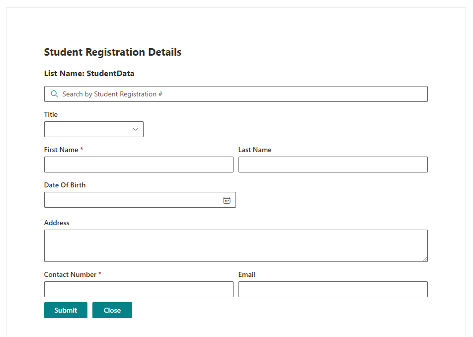
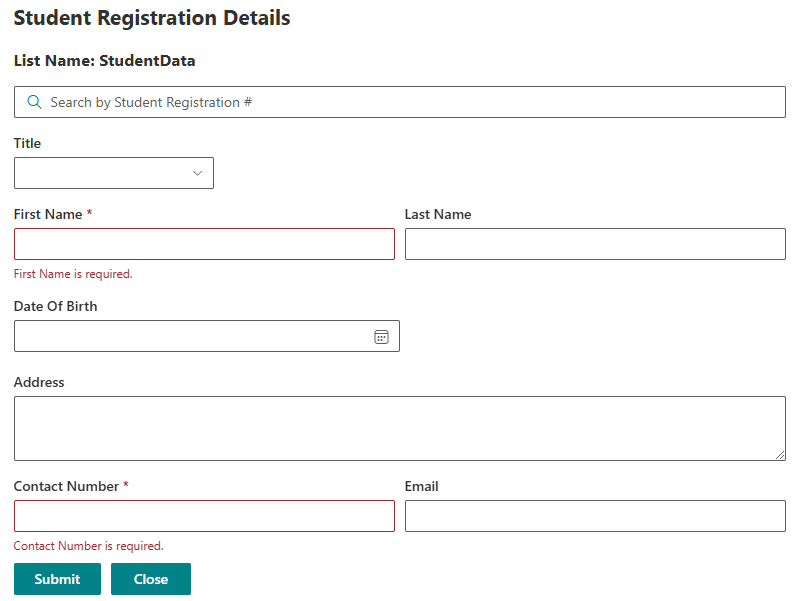
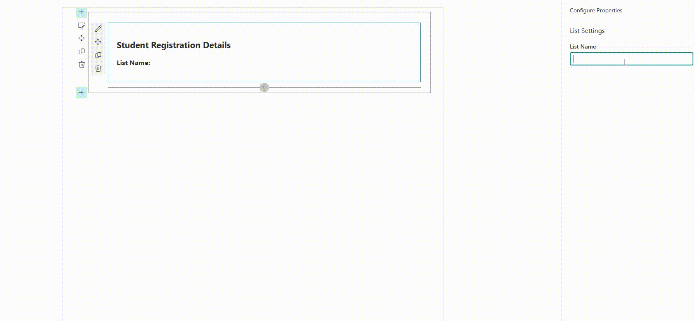

# SPFx Web Part - Student Registration Form CRUD operations

This is a SharePoint Framework (SPFx) Web Part built with React. The web part provides a Student Registration Form, allowing users to add, update, search, and delete student details in a SharePoint list. The form utilizes Fluent UI for a consistent user experience and PnPJS for SharePoint data operations.

## Features

- **React Framework**: Built using React for component-based UI.
- **Fluent UI**: For a clean, modern, and accessible design.
- **PnPJS Library**: For easy interaction with SharePoint data.
- **CRUD Operations**: Add, update, search, and delete student records in a SharePoint list.
- **Error Handling**: Form validation and error display for required fields.

## Prerequisites

- **Node.js**: [Install Node.js](https://nodejs.org/) (LTS version recommended).
- **SharePoint Online**: Must have access to a SharePoint Online site to deploy the web part.
- **SharePoint List**: Create a list with the following fields:

  - Title (Text)
  - FirstName (Text)
  - LastName (Text)
  - DOB (Date)
  - Address (Multiline Text)
  - ContactNumber (Text)
  - Email (Text)
  - OtherTitle (Boolean)

## Getting Started

### 1. Set Up the SPFx Project

Run the following command to create a new SPFx project:

yo @microsoft/sharepoint

Follow the prompts:

Component Type: WebPart
Framework: React
After creating the project, navigate to the root directory of your project.

### 2. Install Dependencies

npm install @fluentui/react @pnp/sp @pnp/logging --save

### 3. Configure PnPJS

Create a file named pnpjsConfig.ts inside src/webparts/[YourWebPartName] folder to set up PnPJS configuration.

### 4. Update serve.json File

In config/serve.json, change the pageUrl to point to a SharePoint page where you want to test the web p

### 5. Run the Project

Run the following command to bundle and test the web part:

gulp serve

### 6. Deploy the Web Part

After development and testing, follow the usual SPFx deployment steps to package and deploy the web part to your SharePoint Online site.

## Usage

Once deployed, the Student Registration Form can be added to any SharePoint page. It provides the following functionalities:

- Add New Student: Fill out the form and click "Submit" to save a new student record.
- Search Student: Use the search box to retrieve student information by ID.
- Update Student: After searching, edit the information and click "Update" to modify the record.
- Delete Student: Click "Delete" to remove the student record.

## Code Structure

- StudentForm.tsx: Main React component containing form fields, validation, and CRUD functions.
- pnpjsConfig.ts: Configuration for PnPJS to initialize SharePoint context.
- IStudentFormProps.ts: Interface defining properties for the component.
- IStudentFormState.ts: Interface defining the state of the component.

## Regards - Shashika Hettiarachchi ❤️
