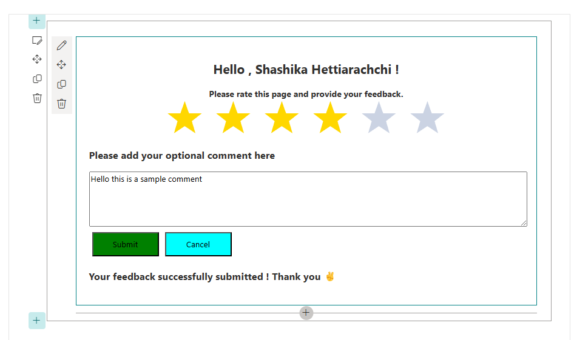
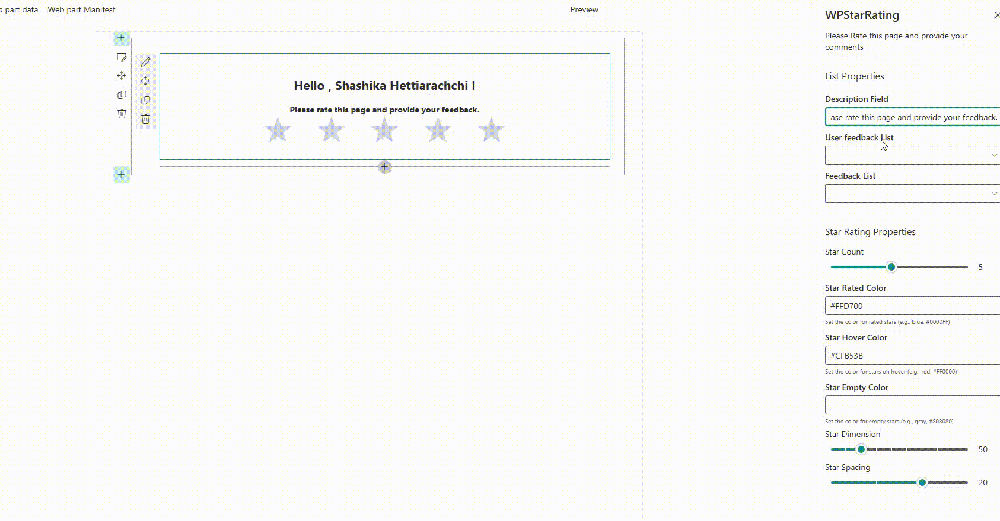

# WP Star Rating Web Part with SharePoint Lists

## Overview

The WP Star Rating is a SharePoint Framework (SPFx) web part that allows users to rate items using a star rating system. Users can provide feedback on selected lists, and the web part dynamically updates and displays ratings.

## Features

- **Star Rating**: Users can select a rating from 1 to 10 stars. (star count can be configure from Properties pane)
- **Feedback Comment**: Optionally, users can provide additional comments along with their ratings.
- **Dynamic Feedback Submission**: The web part submits feedback to specified SharePoint lists and updates existing ratings.
- **Customizable Styles**: Easily customizable through CSS modules.

## Star Rating Component

This web part utilizes the [React Star Ratings component](https://github.com/ekaun/react-star-ratings) to provide a user-friendly star rating experience. This component allows for customizable star dimensions, colors, and spacing, enhancing the overall look and feel of the rating system.

## Prerequisites

- Node.js (LTS version)
- Yeoman
- SharePoint Framework (SPFx) developer tools
- A SharePoint Online site for deployment and testing

## Usage

After deploying the web part, you can add it to any page in your SharePoint site.
Configure the required properties in the web part settings panel, such as the lists for user feedback and feedback detail.

## Regards - Shashika Hettiarachchi ❤️
